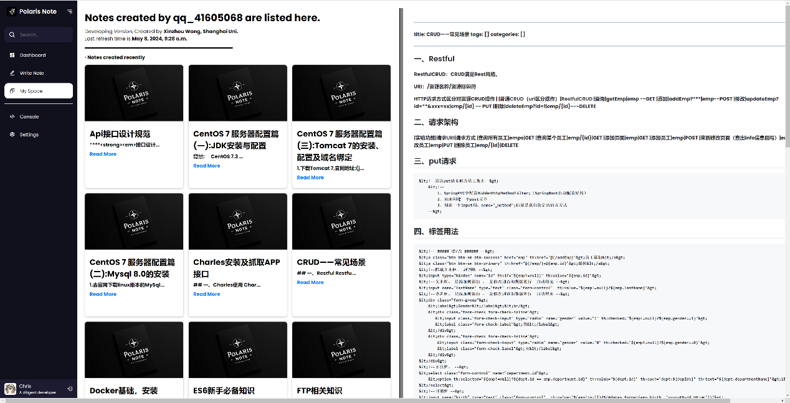

# AI-Based Text Prediction Progressive Web Application (PWA) Development

## ABSTRACT

In the field of software engineering, Progressive Web Applications (PWAs) represent a class of applications developed using web technologies, predominantly accessed through web browsers. Due to their numerous advantages over traditional applications in terms of development costs, user engagement, and commercial viability, PWAs have become the preferred paradigm for many software engineering projects in recent times. Particularly in China, the rapid rise of WeChat Mini Programs, based on PWA technology, has highlighted the necessity for research and development in PWA-related technologies.

In the areas of algorithmic studies and artificial intelligence, in November 2022, the American company OpenAI released the ChatGPT 3 Large Language Model (LLM), which has reached or even surpassed the average human level in various tasks involving language understanding, reasoning, and dialogue generation. Its significant industrial value has made it a focal point of academic research and industrial exploration in recent years, heralding a new era for traditional natural language processing tasks with the advent of GPT-3.

Amidst this innovative disciplinary evolution, this thesis describes the development of a Progressive Web Application based on AI-facilitated text prediction, named Polaris Note. This note-taking software incorporates an AI text-filling tool, merging essential note-taking functionalities such as authentication, browsing, and composition, with an innovative integration of cutting-edge large language model technology within its textual editing module, including text prediction algorithms devised and optimized for specific objectives. The optimization of these algorithms is primarily manifested in enabling the general large language model to counteract fabrications and in modeling user compositional styles for note-taking software requirements to enhance the precision of text prediction.

Specifically, considering the special requirements of the note-taking software's text prediction tasks and the generative deficiencies of the general large language model, the algorithmic construction of Polaris AI integratively employs Term Frequency-Inverse Document Frequency (TF-IDF) for pre-training document filtration; Latent Dirichlet Allocation (LDA) for extraction of features indicative of thematic preferences in compositional styles; and Retrieval-Augmented Generation (RAG) technology based on the general large language model (LLM), with the retrieval segment constructing a private-domain knowledge repository based on WIKI to enhance the generative outcomes.

The significance of this manuscript resides in two dimensions: firstly, it innovatively harnesses AI technology for the modeling of compositional styles and textual prediction, enhancing the efficiency of text content production, and effectuating optimizations on large language models utilized for text prediction; secondly, it autonomously develops software engineering employing PWA and generic Web technology stacks, proffering comprehensive documentation. This serves as a technical reference for the research and engineering of analogous software, accomplishing a reduction in developmental costs and an increase in efficiency.

**Keywords:** Progressive Web Applications; Web Development; Artificial Intelligence and NLP; Database and Data Warehouse Modeling;

## Contents

- [ABSTRACT](#abstract)
- [1 Introduction](#introduction)
  - [1.1 Research Background and Significance](#research-background-and-significance)
    - [1.1.1 Research Background](#research-background)
    - [1.1.2 Research Significance](#research-significance)
  - [1.2 Literature Review](#literature-review)
    - [1.2.1 Review of Progressive Web Application Research and Development](#review-of-progressive-web-application-research-and-development)
    - [1.2.2 Review of Text Prediction Research Based on Large Language Models](#review-of-text-prediction-research-based-on-large-language-models)
  - [1.3 Main Research Content](#main-research-content)
    - [1.3.1 Research Framework](#research-framework)
    - [1.3.2 Research Methods](#research-methods)
    - [1.3.3 Research Innovations](#research-innovations)
- [2 Software Engineering and Development of Polaris Note (PWA)](#software-engineering-and-development-of-polaris-note-pwa)
  - [2.1 Advantages of Polaris as a Progressive Web Application (PWA)](#advantages-of-polaris-as-a-progressive-web-application-pwa)
  - [2.2 Data Collection, Database, and Data Warehouse Modeling in Polaris DB](#data-collection-database-and-data-warehouse-modeling-in-polaris-db)
  - [2.3 Web Architecture Based on Django, Nginx, Uwsgi](#web-architecture-based-on-django-nginx-uwsgi)
  - [2.4 Frontend Design and Functional Implementation with Native HTML, CSS, JavaScript](#frontend-design-and-functional-implementation-with-native-html-css-javascript)
- [3 Polaris AI Smart Text Filling Tool and Its Text Prediction Algorithm](#polaris-ai-smart-text-filling-tool-and-its-text-prediction-algorithm)
  - [3.1 Large Language Models for Text Prediction](#large-language-models-for-text-prediction)
  - [3.2 Causes and Analysis of "Hallucinations" in Large Language Models for Text Prediction](#causes-and-analysis-of-hallucinations-in-large-language-models-for-text-prediction)
  - [3.3 Construction of Polaris AI and Optimization Methods for Generative Hallucinations in Large Language Models](#construction-of-polaris-ai-and-optimization-methods-for-generative-hallucinations-in-large-language-models)
- [4 Implementation of Polaris AI Smart Text Filling Tool](#implementation-of-polaris-ai-smart-text-filling-tool)
  - [4.1 Model Construction and Algorithm Design for Polaris AI Smart Text Filling Tool](#model-construction-and-algorithm-design-for-polaris-ai-smart-text-filling-tool)
  - [4.2 Extraction of Article Topic Preferences Using LDA Topic Model](#extraction-of-article-topic-preferences-using-lda-topic-model)
  - [4.3 Construction of RAG Retrieval Private Domain Corpus Using WIKI Knowledge Base](#construction-of-rag-retrieval-private-domain-corpus-using-wiki-knowledge-base)
  - [4.4 Calculation of Document Similarity Using TF-IDF Weighted Algorithm in Polaris AI](#calculation-of-document-similarity-using-tf-idf-weighted-algorithm-in-polaris-ai)
  - [4.5 Implementation of Advanced Retrieval-Augmented Generation and Writing Style Model in Polaris AI](#implementation-of-advanced-retrieval-augmented-generation-and-writing-style-model-in-polaris-ai)
- [5 Effectiveness Testing of Polaris AI Text Prediction Algorithm](#effectiveness-testing-of-polaris-ai-text-prediction-algorithm)
  - [5.1 Test Configuration and Design](#test-configuration-and-design)
  - [5.2 Relationship Between Various Parameters of Polaris AI and Response Speed](#relationship-between-various-parameters-of-polaris-ai-and-response-speed)
  - [5.3 Effectiveness of Enhanced Generation Based on Writing Style in Polaris AI](#effectiveness-of-enhanced-generation-based-on-writing-style-in-polaris-ai)
- [Conclusion](#conclusion)
- [References](#references)
- [Appendix](#appendix)
- [Acknowledgments](#acknowledgments)

## Introduction

### Research Background and Significance

#### Research Background

In the field of software development, Progressive Web Applications (PWAs) are gaining market share and have shown a trend of replacing traditional applications. PWAs are a technically mature form of application software built using a general Web technology stack and are widely used in small and medium-sized software services. In recent years, given the significant advantages of PWAs, more and more software engineering projects have chosen to develop browser-rendered PWAs rather than traditional applications based on operating systems. This includes general-purpose software for the mass market, such as OpenAI's ChatGPT; industrial software for office use, such as Tencent's OrcaTerm and Google's Google Workspace; and small information management software with customized needs, such as course selection systems and academic management systems in various universities. In China, Tencent's WeChat team creatively integrated PWA technology into WeChat, and the WeChat Mini Programs based on this have gradually monopolized the mobile application market in mainland China. According to Xinjing News, within 500 days of the launch of the WeChat Mini Program feature, there were 580,000 available Mini Programs with a daily active account number of 170 million, indicating a promising commercial outlook.

At the same time, there have been significant breakthroughs in data science and natural language processing in academia and industry. In November 2022, the American company OpenAI launched the ChatGPT 3 Large Language Model (LLM), which in language understanding, reasoning, dialogue generation, and other tasks, has reached or even surpassed human average levels. Its demonstrated substantial industrial value has made it a focus of academic and industrial research in recent years. In China, Baidu's Wenxin ERNIE 3.0 has taken the lead in the industry. On March 5, 2024, Premier Li Qiang emphasized "vigorously promoting the construction of a modern industrial system and accelerating the development of new productive forces" in his government work report, which includes the development of new labor tools such as artificial intelligence (AI).

#### Research Significance

The significance of this paper lies in two aspects: firstly, it creatively utilizes AI technology for modeling writing styles and text prediction, improving the efficiency of text content production, and optimizing large language models used for text prediction; secondly, it independently develops software engineering adopting PWA and general Web technology stacks and provides comprehensive documentation, offering technical references for the research and engineering of similar software, achieving cost reduction and efficiency improvement in development.

### Literature Review

#### Review of Progressive Web Application Research and Development

##### Progressive Web Application

The concept of Progressive Web Applications can be traced back to 2007 when Apple proposed that the iPhone could run applications created using Web 2.0 internet standards without the need for a software development kit (SDK), meaning applications would be fully integrated into the device through the Safari browser engine. This concept eventually became the predecessor of the App Store. In 2015, designer Frances Berriman and Google Chrome engineer Alex Russell coined the term "Progressive Web Application" (PWA) to describe applications that utilize new features supported by modern browsers.

##### Case Studies and Architectures of Progressive Web Application Research and Development

The development architecture of Progressive Web Applications is relatively mature, and the industry generally adopts open-source architectures or self-developed architectures for developing such applications based on their circumstances.

| Application Name | Main Architecture | Architecture Type | Website                     |
|------------------|-------------------|-------------------|-----------------------------|
| Uber             | MVC, Riblets      | Self-developed    | https://www.uber.com/       |
| Starbucks        | Vue               | Open-source       | https://www.starbucks.com/  |
| Amazon           | AWS Lambda        | Self-developed    | https://www.amazon.com/     |
| Netflix          | Microservices     | Open-source       | https://www.netflix.com/    |
| Facebook         | React, Flux       | Open-source       | https://www.facebook.com/   |
| X (Twitter)      | Rails, Scala      | Open-source       | https://twitter.com/        |
| Pinterest        | Django, Flask     | Open-source       | https://www.pinterest.com/  |
| Instagram        | Django            | Open-source       | https://www.instagram.com/  |

In academia, the development of Progressive Web Applications generally uses open-source frameworks. For example, He Xiaohui et al. used the Django framework to develop a face recognition Web application based on Baidu AI, achieving real-time feature extraction of humanoid graphic objects; Loreto et al. used the React framework to develop a single-page web application based on MongoDB, achieving management and monitoring of obstetric information.

#### Review of Text Prediction Research Based on Large Language Models

##### Text Prediction and Text Generation

Text prediction and text generation are two closely related but distinct concepts and technologies in the field of natural language processing.

Specifically, text prediction focuses on predicting the next words or sentences based on given text content. This type of task is commonly used in scenarios such as autocomplete features (like intelligent prediction in input methods), spell-checking, and grammar correction. The goal of text prediction is to predict the most likely subsequent text based on existing text to help users complete input faster or improve text accuracy.

Text generation is broader; it not only includes tasks of generating text based on some input (such as generating an article based on a topic or generating descriptions based on images) but also includes tasks of generating text from scratch (like creative writing, automatically generating news reports, etc.). The goal of text generation is to create coherent and meaningful text content based on input data or solely relying on the model's learned knowledge.

This paper focuses on text prediction based on user writing styles, specifically the text prediction algorithm of Polaris AI's intelligent text filling tool, which is a unification of prediction and generation tasks. In the context of this paper, text prediction and text generation are emphasized to share similar model architectures and algorithms.

##### Traditional Natural Language Processing and NLP in the Era of Large Language Models

The emergence of large language models has had a significant impact on traditional natural language processing research. In 2022, OpenAI released GPT-3, which garnered attention. The following year, Che Wanxiang et al. pointed out and elaborated on the transformative role of large language models in natural language processing in their article "Natural Language Processing in the Era of Large Models."

They pointed out that although large models have strong domain generalization capabilities and have significantly impacted traditional natural language core tasks, natural language processing in the era of large models still holds great potential. Using large models as research tools can revolutionize NLP research paradigms, integrate scattered tasks, and enhance core capabilities. Meanwhile, in-depth research on explainability, fairness, security, and information accuracy will improve the quality of technology and services.

In summary, natural language processing in the era of large language models, especially in the GPT-3 era, should be distinguished from traditional natural language processing. Or rather, natural language processing tasks in the era of large language models should have entirely new directions.

##### Text Prediction Based on Writing Style in the Era of Large Language Models

As a branch of linguistics, the study of stylistics has a long history. The English term "stylistics" was first proposed by Hartmann and Stork in their co-authored "Dictionary of Language & Linguistics," considering stylistics as a discipline applying linguistic methods and knowledge to study text styles. As Zhang Yunliang et al. stated when modeling writing styles using natural language processing methods, each author's works are unique, with their writing styles reflected in vocabulary, sentence patterns, and rhetorical devices. Building on the above, this paper believes that defining and recognizing writing styles involves multiple dimensions, including language choice, sentence structure, rhetorical devices used, thematic preferences, and emotional preferences.

In the practice of machine learning and natural language processing, transforming the manifestations of these dimensions into highly quantifiable features that computers can recognize is key to improving prediction accuracy.

Before the advent of generative language models, attempts to model writing styles using traditional NLP were already present. They often used common text classification algorithms, such as K-nearest neighbors, Naive Bayes, and Hidden Markov Models. These algorithms performed well in classification tasks, especially in identifying authors. For example, Sun Xiaoming et al. used function words as features to construct vector space models and adopted template matching algorithms, KNN algorithms, and SVM algorithms, achieving the highest accuracy rates of 89.51%, 91.54%, and 93.58%, respectively, effectively classifying author writing styles. However, in the field of text prediction, research and results on text generation tasks based on writing styles are relatively scarce in both academia and industry.

After the advent of generative language models, especially with the emergence of GPT-2, text generation became a possible vision, but its generative results still lacked logic and reasoning ability. At the time, although advancements in deep learning and natural language processing improved the accuracy and fluency of dialogue systems, challenges such as the temporal autoregressive problem of the Transformer architecture and the modeling capabilities of unidirectional language models persisted, leading to issues like blandness, incoherence, and semantic repetition in GPT-2 generated texts.

With the emergence of GPT-3, due to its powerful reasoning and generation capabilities, the potential in text prediction tasks based on specific writing styles became evident, allowing text generation tasks to be effectively achieved. The generated texts are coherent and consistent, reflecting strong feature extraction and imitation capabilities.

### Research Breakthroughs and Research Value

In the field of data science and natural language processing, the emergence of GPT-3 has brought about the potential for revolutionary breakthroughs in the field of text generation tasks. The organic combination of traditional NLP technology and large language models, especially research on optimizing the generative performance of large language models with the assistance of traditional NLP algorithms, shows great potential.

As Che Wanxiang et al. stated, in the future, NLP will provide critical support for the realization of General Artificial Intelligence (AGI). This paper affirms this perspective and, under this guidance, comprehensively uses various traditional NLP methods to optimize the output of generative artificial intelligence at the algorithm level, striving to reduce generative hallucinations to the greatest extent and improve prediction accuracy. The Polaris AI text-filling algorithm proposed in this paper, based on writing style, retains the powerful reasoning capabilities of large language models while optimizing the generative hallucination problem where the generation is too divergent and deviates from the writing style.

In the field of software engineering, the rising market share of PWAs makes the development of open-source, highly reusable PWA software using a general technology stack more significant in commercial and production practice. The development method provided in this paper has high reference value in terms of development efficiency, cost, and software quality (including user experience and security), offering methods and references for subsequent academic or industrial PWA software development.

### Main Research Content

#### Research Framework

The content of this paper mainly consists of two parts.

The first part is the development of a Progressive Web Application (PWA). This web application is a note-taking software named Polaris Note that integrates an AI text-filling tool (referred to as Polaris). This software creatively integrates cutting-edge large language model technology in its text editing module and includes specifically designed text prediction algorithms. Specifically, Polaris includes a login system, personal homepage, note writing and uploading, browsing personal and others' notes, note management, application settings, and other functional modules. The built-in Polaris AI intelligent text-filling tool can predict the text users are likely to write, assisting in writing note documents.

This section will detail the architectural design of Polaris Note, including but not limited to its characteristics and advantages as a Progressive Web Application (PWA), backend database design and implementation, frontend interface development, and integration of the AI text-filling tool. Special attention will be given to the data collection, database, and data warehouse modeling of Polaris DB, as well as the support role of a web architecture based on Django, Nginx, and Uwsgi in application operation. Additionally, measures taken by Polaris Note to ensure data security will be discussed, including but not limited to the key authentication technology on the browser side and response verification components on the server side.

The second part is the design of targeted text prediction algorithms for the Polaris AI intelligent text-filling tool. Considering the special requirements of text prediction tasks in note-taking software and the generative deficiencies of general large language models, this paper comprehensively uses Term Frequency-Inverse Document Frequency (TF-IDF) for pre-training document filtering; Latent Dirichlet Allocation (LDA) topic modeling for feature extraction of thematic preferences in writing styles; Retrieval-Augmented Generation (RAG) technology based on general large language models (LLM), constructing a private domain knowledge base based on WIKI as a retrieval database to enhance generative results, and other methods of integrating traditional NLP and large language model generation to build the Polaris AI intelligent text generation model. This algorithm model significantly optimizes the performance of large language models.

This section will detail the construction process of Polaris AI, particularly the optimization methods for addressing generative hallucinations in large language models. It analyzes the special requirements of text prediction tasks in note-taking software, the generative deficiencies of general large language models, and details the algorithm construction of Polaris AI, including the comprehensive use of Term Frequency-Inverse Document Frequency (TF-IDF) for pre-training document filtering; Latent Dirichlet Allocation (LDA) topic modeling for feature extraction of thematic preferences in writing styles; and advanced Retrieval-Augmented Generation (ARAG) technology based on general large language models (LLM), constructing a private domain knowledge base based on WIKI as a retrieval database to enhance generative results.

#### Research Methods

This paper adopts an empirical approach, starting from scratch to build a Progressive Web Application at the software development level and testing its effectiveness to demonstrate the software's usability. At the algorithm level, it constructs a large language model optimization algorithm based on various traditional NLP methods, evaluating relevant metrics at each stage of the model to demonstrate prediction accuracy.

#### Research Innovations

From the perspective of software development, the design, development, and testing of this project are entirely independent. Apart from replaceable language models, its design and development do not rely on any commercial or closed-source external technologies or frameworks, thus providing high reusability value.

From the perspective of artificial intelligence and NLP algorithm construction, in the GPT-3 era, organically combining traditional NLP technology with large language models, especially using traditional NLP methods to optimize large language model results, is a relatively novel concept, with limited academic or production practice. The optimization algorithm proposed in this paper can serve as a supplement and reference.

## Software Engineering and Development of Polaris Note (PWA)

The Polaris Note software project is a PWA-based software engineering project comprising three main systems. Polaris Note is the main body of the note-taking software, including basic functions such as note writing and browsing. Polaris DB is the database management system (DBMS) for the Polaris Note software project, used for data modeling and extraction. Polaris AI is the intelligent text-filling tool of Polaris.

The main part of Polaris does not rely on any commercial or closed-source external technologies or frameworks in its development, providing high reusability value for the methods and documentation summarized in this project. Polaris can meet general technical indicators of mainstream commercial software, including performance and response time, cross-platform compatibility, and AI suggestion accuracy. The reuse and use of Polaris software can be found in the supplementary documentation; this chapter only explains the core technologies.

## 2.1 Advantages of Polaris as a Progressive Web Application (PWA)

PWAs have significant advantages compared to traditional applications, mainly in three aspects.

### 2.1.1 Development Advantages

From a development perspective, the development of PWAs is based on a common web technology stack and can run on most system browsers. Traditional applications often require more developers to adapt to various operating systems on the market. Additionally, with the emergence and continuous improvement of front-end development frameworks such as React and Vue, and back-end development frameworks such as Flask and Django, PWA development has become unprecedentedly efficient. On the mobile end, Tencent's self-developed WeChat Mini Program development, using WXML (a variant of HTML) and WXSS (a variant of CSS) and commonly adapted to JavaScript, allows front-end engineers to quickly get started without additional learning costs.

### 2.1.2 User Experience Advantages

From a user experience perspective, PWAs eliminate the download and installation process and can be run directly using a browser, which is not only very convenient but also greatly improves security. Additionally, due to the front-end and back-end computing logic of PWAs, they generally do not require users to manually update the software, and the program's response time becomes shorter with the rapid development of network channel technology, providing an increasingly smooth user experience.

### 2.1.3 Commercial Advantages

From a commercial perspective, PWAs do not rely on application stores such as Apple's App Store or Google Play, avoiding intermediary fees in distribution and reducing customer acquisition costs (CAC).

### 2.1.4 Controversy over PWA Energy Consumption

Despite the numerous advantages of PWAs, they face criticism for being widely considered high-energy consumption solutions. Addressing this criticism, Huber et al. conducted a study in 2022 comparing the energy consumption differences between Progressive Web Applications (PWAs) and other mobile development methods. They implemented five versions of the same application using different development methods and conducted energy consumption analysis in four execution scenarios on two Android devices. The experimental results failed to demonstrate inherent technical disadvantages of PWAs compared to other mobile cross-platform development (MCPD) methods in terms of UI energy consumption.

## 2.2 Data Collection, Database, and Data Warehouse Modeling in Polaris DB

### 2.2.1 Original Data Selection and Data Mining Methods for Polaris DB

In the software development and algorithm design stages, selecting original data that aligns with the characteristics of future user data as input data (Independent Variables) is particularly important. This section introduces the considerations for selecting original data for Polaris DB and the data acquisition methods based on advanced web data mining technologies.

#### 2.2.1.1 Selection of Original Data for Polaris DB

Note-taking software has its uniqueness in the current market, but there are also excellent examples. Notion is one of them. Notion differs from the previous generation of cloud note-taking software in that it is not just a note-taking tool with information collection and organization capabilities but an "All In One" text data integration tool. In similar domestic software, ByteDance's Feishu Docs also leads the market with a similar concept of "collaborative office."

Based on the precedent of Notion, a PWA note-taking software for users, there are two types of applicable audiences for note-taking software. The first is specialized blog writing, where the article data set of this type of user has homogenous themes. Some users are accustomed to opening columns when writing, such as technical documentation authors who open blog columns for specific technology stacks, where all documents are related to that technology stack. At this time, the core feature dimension of the author's writing style is thematic preference.

The second is users' daily notes (essays, memos), where the article data set of this type of user has relatively dispersed themes, and the article themes may vary with changes in the author's life experiences. However, although the themes of the articles are almost untraceable, the authors still have relatively fixed writing styles, reflected in their language choices, sentence structures, use of rhetorical devices, and emotional preferences.

The target audience for Polaris Note is also similar. Therefore, based on the above analysis, this paper selects data sets that meet the two types of audiences from two sources for data mining. For specialized thematic data, this paper selects public data from the domestic CSDN technical blog, where most article content meets the unified theme but has different writing styles besides thematic preferences; for dispersed thematic data, this paper selects public diary data from the Lapuda Diary website, where the article content has no fixed theme, and different users have different writing styles.

#### 2.2.1.2 Web Data Mining Methods Based on requests and bs4

Web-based data mining generally uses the local host to send HTTP-based request requests to the target URL, returns the page HTML text, and then uses regularization tools such as re, bs4, or native Python text string processing functions to capture specific information.

In the development of Polaris Note, due to the need to mine original data for specific themes, this paper first specifies the theme and conducts theme retrieval based on the URL request rules of the CSDN website program.

```python
self.url = 'https://so.csdn.net/api/v3/search?q={}&t=all&p={}'
```

This retrieves a list of column authors under a specific theme. Based on this list, locate the author's homepage and crawl their article URL links.

```python
response = requests.get(f'{url}/{page_num}', headers=headers)
soup = BeautifulSoup(response.content, 'html.parser')
article_table = soup.find('div', class_='article-list')
```

Navigate to the article browsing page based on the link and use bs4-based page XPath indexing to locate article titles, locations, times, authors, and content for text data mining.

```python
response = requests.get(url, headers=headers, allow_redirects=False)
user_xpath = '/html/body/div[1]/div/div/div[1]/div[1]/div[2]/a'
```

For dispersed themes, data is indexed by author. Therefore, for crawling the Lapuda Diary web page, this paper constructs a URL list based on the article ID in order.

```python
url = f'http://www.lapuda.org/diary/{i}/'
response = requests.get(url, headers=headers, allow_redirects=False)
content_xpath = '//*[@id="diary-content"]'
```

### 2.2.2 MySQL Database Deployment and Table Design Based on Linux

In the Polaris project, Linux Ubuntu operating system and MySQL are used as the primary database management systems. Linux Ubuntu, as an open-source operating system, is available, stable, mature, and has an active development community, making it one of the mainstream server operating systems. MySQL is an open-source relational database management system known for its stability, cross-platform support, and excellent scalability.

Database design follows the basic principles of relational database design, namely the three normal forms, to optimize query efficiency and reduce data redundancy.

- First Normal Form (1NF) - Atomicity Principle

  Condition: All fields in the table are atomic, meaning each field cannot be decomposed into smaller data units. Modern databases architecturally prevent violations of the first normal form.

- Second Normal Form (2NF) - Satisfies 1NF, no partial dependency

  Condition: All tables satisfy 1NF, and every non-primary key field in a table completely depends on the primary key. For example, in the polaris.predictions table, all non-primary key fields, such as predicted_text and prediction_time, completely depend on the primary key prediction_id, with no partial dependency.

- Third Normal Form (3NF) - Satisfies 2NF, no transitive dependency

  Basic Condition: All tables satisfy 2NF, and no transitive dependency exists between non-primary key fields. For example, in the polaris.users table, non-primary key fields such as user_name, password, and profile_picture do not depend on each other, with each field directly depending on the primary key uid.

- Boyce-Codd Normal Form (BCNF) - Minimal Redundancy Dependency

  Partial Condition: BCNF requires every determinant in a database table to be a candidate key, meaning every field directly depends on the primary key. The main dimension and fact table designs of Polaris DB meet this requirement. However, considering that designing the database to BCNF might lead to excessive decomposition and increase query complexity, some dimension and fact tables of Polaris DB do not meet BCNF requirements.

### 2.2.3 Database Modeling and Data Extraction Tools in Polaris DB

#### 2.2.3.1 Data Dictionary and Key Design of Main Fact Tables in Polaris DB

| Field Name | Data Type     | Nullable | Key | Description                                          |
|------------|---------------|----------|-----|------------------------------------------------------|
| nid        | INT           | NO       | PRI | Unique identifier for notes                          |
| title      | VARCHAR(255)  | YES      |     | Title of the note                                    |
| content    | TEXT          | YES      |     | Content of the note                                  |
| location   | VARCHAR(255)  | YES      |     | Location where the note was created                  |
| time       | VARCHAR(255)  | YES      |     | Time when the note was created                       |
| uid        | INT           | YES      |     | User ID of the note's author                         |
| dir_link   | VARCHAR(255)  | YES      |     | Link to the associated .md file of the article       |
| time_id    | INT           | NO       |     | Time when the data was created                       |

Full user note table, fact table, storing all note information created by users, including note title, content, creation location, creation time, author's user ID, and the storage location of their article .md file on the server.

| Field Name      | Data Type    | Nullable | Key | Description                         |
|-----------------|--------------|----------|-----|-------------------------------------|
| uid             | INT          | NO       | PRI | Unique identifier for users         |
| user_name       | VARCHAR(50)  | NO       | UNI | Username                            |
| password        | VARCHAR(255) | NO       |     | User password                       |
| profile_picture | BLOB         | YES      |     | User's profile picture              |
| time_id         | INT          | NO       |     | Time when the data was created      |

Full user account table, fact table, storing account information of all users in the system, including user ID, username, password, and profile picture, for user identity recognition and management.

| Field Name      | Data Type        | Nullable | Key | Description                              |
|-----------------|------------------|----------|-----|------------------------------------------|
| prediction_id   | INT              | NO       | PRI | Unique identifier for prediction actions |
| model_id        | INT              | YES      | FK  | ID of the AI model used                  |
| input_id        | INT              | NO       | FK  | ID of the input prompt text              |
| predicted_text  | TEXT             | YES      |     | Text generated by AI prediction          |
| prediction_time | DATETIME         | NO       |     | Time when the prediction occurred        |
| uid             | INT              | NO       | FK  | User ID to whom the action belongs       |
| if_adopted      | BOOLEAN          | NO       |     | Whether the prediction was adopted by the user |
| time_id         | INT              | NO       |     | Time when the data was created           |

Full prediction action table, fact table, recording all AI model prediction actions on user inputs, including AI model ID used, input ID, generated text, prediction time, user ID to whom the action belongs, and whether the prediction was adopted by the user. Based on user adoption, further analysis and tuning of the Polaris AI model can be conducted.

| Field Name         | Data Type    | Nullable | Key | Description                                               |
|--------------------|--------------|----------|-----|-----------------------------------------------------------|
| input_id           | INT          | NO       | PRI | ID of the input prompt text                               |
| rag_pretrained_docs| JSON         | NO       | FK  | Document index for training retrieval corpus              |
| rag_res_link       | VARCHAR(255) | NO       |     | Storage address of retrieval vector database              |
| time_id            | INT          | NO       |     | Time when the data was created                            |

Full prompt word retrieval enhancement result table, fact table, storing input data related to RAG process. Specifically, it stores user input prompts and associates them with retrieval results enhanced by pre-trained models. Dimensions include prompt ID, related document index, and storage address of retrieval results on the server.

#### 2.2.3.2 Database Modeling and Data Warehouse Generation Logic of Main Dimension Tables in Polaris DB

| Field Name | Data Type   | Nullable | Key | Description                                             |
|------------|-------------|----------|-----|---------------------------------------------------------|
| time_id    | INT         | NO       | PRI | Unique identifier for time                              |
| date       | DATE        | NO       |     | Full date (year-month-day)                              |
| day        | INT         | NO       |     | Day of the month                                        |
| month      | INT         | NO       |     | Month                                                   |
| quarter    | INT         | NO       |     | Quarter                                                 |
| year       | INT         | NO       |     | Year                                                    |
| week       | INT         | NO       |     | Week number                                             |
| day_name   | VARCHAR(9)  | NO       |     | Day of the week                                         |
| is_weekend | BOOLEAN     | NO       |     | Whether it is a weekend                                 |
| is_holiday | BOOLEAN     | NO       |     | Whether it is a holiday                                 |

Time sequence dimension table, dimension table, used for time-related data extraction in data analysis. The time sequence dimension table provides data analysis from a temporal perspective, helping administrators understand trends in user behavior over time, allowing almost all business activities to be sliced and analyzed by time. For example, analyzing the number of notes created by users each month, changes in AI prediction adoption rate quarterly, and comparing user activity on weekends and weekdays.

#### 2.2.3.3 Native SQL-Based Data Extraction Tools in Polaris DB

Although Django, as one of the most mainstream web architectures, provides a feature-rich Object-Relational Mapping (ORM) system for database management, this project still adopts Python SQL Server's native SQL statements for data extraction. This is mainly due to the following reasons.

From a performance perspective, although the ORM system provides a high level of abstraction of database structures, offering significant advantages in improving development efficiency, in small applications, especially in production environments, ORM can cause a degree of performance burden.

From a practical perspective, native SQL statements allow direct interaction with the database, providing developers with simple and precise control over database operations, enabling analysts without a software engineering background to use native SQL statements to handle complex queries and other database operations. Direct use of SQL statements also allows full utilization of advanced features provided by specific database management systems (such as special index types, stored procedures, and triggers) that cannot be achieved in ORM.

```python
from app01.middleware.SQLConn import polaris_db
username = polaris_db(f"SELECT user_name FROM users WHERE uid='{uid}';")[0][0]
res = polaris_db(f"SELECT title, content, dir_link FROM notes WHERE uid='{uid}';")
```

The connection and extraction operations for MySQL databases are performed using Python SQL Server's mysql.connector, inputting SQL commands and returning query results as two-dimensional tuple lists or the number of rows affected, depending on the nature of the SQL command.

```python
import mysql.connector
with connection.cursor() as cursor:
    cursor.execute(query)
    if query.strip().lower().startswith('select'):
        results = cursor.fetchall()
        # Return the fetched rows for SELECT queries
        return results
    else:
        connection.commit()
        # Return the number of rows affected for other queries
        return cursor.rowcount
```

## 2.3 Web Architecture Based on Django, Nginx, Uwsgi

Django is a high-level Python Web framework that encourages rapid development and clean, pragmatic design. Nginx is a high-performance HTTP and reverse proxy server, and can also serve as a load balancer. Uwsgi is a web server that implements WSGI, uwsgi, and HTTP protocols. The combination of Django, Nginx, and Uwsgi allows the Polaris project to build a high-performance, easy-to-maintain, scalable web application architecture.

### 2.3.1 Django Development and Nginx-Based Forwarding Web Architecture in Polaris

The Polaris project adopts the Django framework for development because Django provides a complete Web development solution, including but not limited to ORM (Object-Relational Mapping), middleware support, template engine, form processing, and security mechanisms. These modules and Django's rich and active community resources can effectively speed up development. Additionally, Django follows the MVC (Model-View-Controller) design pattern, making the project structure clear, easy to maintain, and extend.

Nginx, as a high-performance HTTP server and reverse proxy, is responsible for receiving HTTP requests from clients and forwarding them to the backend Django application. Nginx's efficient handling of static file requests and its optimized handling of HTTP requests enable the web application to respond quickly to user requests. Furthermore, Nginx can provide load balancing functionality, distributing requests to multiple Django instances, further enhancing the availability and scalability of the application.


**Figure 1:** Web architecture based on Django, Nginx, Uwsgi

Among them, Uwsgi serves as the application server, implementing the WSGI protocol and acting as a bridge between the Django application and Nginx. Through Uwsgi, the Django application can process requests forwarded by Nginx and return responses to Nginx, which then forwards them to the client.

#### 2.3.1.1 Directory Structure and Functional Modules of the Polaris Django Project

The directory structure of the Polaris Note project can be found in the appendix.

| File Name       | Functional Description                                                                                  |
|-----------------|---------------------------------------------------------------------------------------------------------|
| uwsgi.ini       | uWSGI server configuration file, defining the interaction between the project and the uWSGI server.     |
| .env            | Environment variable file, containing database connection information and API keys for Baidu Wenxin, etc.|
| manage.py       | Django command-line tool entry, used to execute various Django commands, such as running the development server, database migration, static file fetching. |
| uwsgi.pid       | File storing the uWSGI service process ID, used for process management.                                 |

**Table 7:** Functional Information of Polaris Note Project Modules

| File Name           | Functional Description                                                                                                                |
|---------------------|---------------------------------------------------------------------------------------------------------------------------------------|
| uwsgi.log           | File for recording uWSGI server logs, used for monitoring and debugging.                                                              |
| django.log          | File for recording Django application logs, used for application monitoring and error tracing.                                        |
| urls.py (Polaris/)  | Project URL configuration file, defining the mapping relationship between URLs and views.                                             |
| polaris.sql         | Contains SQL files exported from the database, used for data backup or migration.                                                     |
| wsgi.py             | WSGI application deployment entry, connecting the web server with the Django application.                                             |
| settings.py         | Django project settings file, containing configuration information such as database configuration, middleware configuration, security configuration. |
| urls.py (app01/)    | Application-level URL configuration file, defining URL routes within the app01 application.                                           |
| views.py            | Defines the application logic for handling requests and returning responses.                                                          |
| openai_api.py       | Middleware & tool module, used for interacting with the OpenAI API.                                                                   |
| baidu_api.py        | Middleware & tool module, used for interacting with the Baidu API.                                                                    |
| SQLConn.py          | Database connection module, encapsulating database operations.                                                                        |
| my_space.css        | Custom style file for designing the style of the "My Space" page.                                                                     |
| polaris.css         | Main style file, defining the project's basic styles.                                                                                 |
| note_template.js    | JavaScript file for the note template feature.                                                                                        |
| my_space.js         | JavaScript logic for the "My Space" page.                                                                                             |
| write_note.js       | JavaScript logic providing the functionality for writing notes and Polaris AI frontend features.                                      |
| dashboard.html      | HTML template for the dashboard page, displaying an overview of user information.                                                     |
| my_space.html       | HTML template for the "My Space" page, displaying the user's personal space.                                                          |
| note_template.html  | HTML page for note templates, used for creating or editing note templates.                                                            |
| write_note.html     | HTML page template for writing notes, providing an interface for writing notes.                                                       |

#### 2.3.1.2 Nginx-Based Mount Configuration and Integrated Log File Management System

The Nginx logging module is used to record access and error logs. Based on this, various data analysis dimensions for logs are provided. Nginx configuration is located in the /etc/nginx/sites-available/ directory. The server block defines the ports and server names being listened to, while the location block specifies the handling of different requests.

**Table 8:** Nginx Access.log Data Table

| Field Name             | Description                                                                 |
|------------------------|-----------------------------------------------------------------------------|
| remote_addr            | Client IP address                                                           |
| remote_user            | Authenticated user name. If no user authentication has been performed, this field is empty. |
| time_local             | Access time and time zone, recorded in the format xxxx-xx-xx.               |
| request                | Complete HTTP request line, including request method (e.g., GET, POST), requested URI, and HTTP protocol version. |
| status                 | HTTP response status code, such as 200, 404, etc.                           |
| body_bytes_sent        | Number of bytes sent to the client for the response body, excluding the header. |
| http_referer           | URL of the referring page for the current request. If there is no referring page, this field is "-". |
| http_user_agent        | Identity string of the client browser or other client application that initiated the request. |
| request_time           | Total time taken to process the request, in seconds.                        |
| upstream_response_time | Time taken to forward the request to and receive a response from an upstream server (e.g., PHP-FPM, proxy server). |
| http_x_forwarded_for   | Forwarded client IP address when using HTTP proxies or load balancers.      |

### 2.3.2 Data Security of Polaris as a Web Project

Polaris employs multiple methods to ensure user account and information security.

#### 2.3.2.1 Browser Key Authentication Based on Cookies Technology

To balance the security of single-user identity verification and the coherence of user experience, Polaris uses cookies technology, which is based on browser-stored user session information. For security, cookies are encrypted and the HttpOnly flag is set to prevent cross-site scripting attacks (XSS). For coherence, within 300 seconds of a single login, the browser cache records the user's authentication information (credentials), eliminating the need for re-login. Refreshing the page after 300 seconds requires re-login.

```html
if (response.uid) {
    console.log(response.uid);
    function setCookie(name, value, seconds) {
        var expires = "";
        if (seconds) {
            var date = new Date();
            date.setTime(date.getTime() + (seconds * 1000));
            expires = "; expires=" + date.toUTCString();
        }
        document.cookie = name + "=" + (value || "") + expires + "; path=/";
    }
    setCookie("uid", response.uid, 300);
    window.location.href = "dashboard/" + response.uid + "/";
} else {
    alert("Login failed!");
}
```

The logic for account and password authentication is performed on the server side and transmitted to the frontend based on Ajax, ensuring security.

```python
from app01.middleware.SQLConn import polaris_db
credential = polaris_db(f"SELECT uid FROM users WHERE user_name='{username}' AND password='{password}';")
```

#### 2.3.2.2 Server Response Verification Components Based on django-cors-headers Plugin and Strict CSRF Strategy

CORS (Cross-Origin Resource Sharing) is a mechanism that allows web applications to perform cross-origin access control. Polaris uses Django's django-cors-headers plugin to add CORS headers to responses. CSRF (Cross-Site Request Forgery) is an attack where attackers exploit the user's login status to initiate malicious requests. Django has a built-in CSRF protection mechanism that prevents such attacks by adding a CSRF token to forms.

```python
INSTALLED_APPS = [
    ...
    'corsheaders',
]
MIDDLEWARE = [
    ...
    'django.middleware.csrf.CsrfViewMiddleware',
    'corsheaders.middleware.CorsMiddleware',
]
CORS_ALLOW_ALL_ORIGINS = False
CORS_ALLOWED_ORIGINS = [
    ...,
    "http://localhost"
]
```

The above cross-origin request warnings can effectively block requests not originating from this server.

## 2.4 Frontend Design and Functional Implementation with Native HTML, CSS, JavaScript

### 2.4.1 Page Layout Demonstration and Design

Frontend pages are written using native HTML, CSS, and JavaScript. The following demonstrates the main pages; for complete browsing of the Polaris PWA project, see the appendix.

#### 2.4.1.1 Note Browsing Page

The personal note space, i.e., the note browsing page (my_space), is used to view previously uploaded notes. The page is fully responsive and can adapt to different window sizes. The page layout consists of a navigation bar, a note browsing area, and a note content area.



**Figure 2:** Personal note space for username qq_41605068 (user ID 2027)

URL: <http://129.211.1.243/app01/polaris/my_space/2027/>

#### 2.4.1.2 Note Writing Page

The note writing page (write_note) is used for editing and uploading notes. This text editor supports formatting operations such as bold, italics, underline, and strikethrough, and supports .md syntax. This section integrates the intelligent text-filling tool, allowing users to obtain prediction suggestions and see the server response status in the status bar.


**Figure 3:** Note writing page for username jacke121 (user ID 2007)

URL: <http://129.211.1.243/app01/polaris/write_note/2007/>

### 2.4.2 JSON Data Transmission Method Based on JavaScript Ajax

Ajax (Asynchronous JavaScript and XML) is a technology for asynchronous data exchange and web page updates between the client and server, allowing web pages to exchange data with the server and update partial page content without reloading the entire page.

JSON (JavaScript Object Notation) is a lightweight data exchange format. In JavaScript, JSON.stringify() is used to convert objects into JSON strings, and JSON.parse() is used to convert JSON strings into objects.

Using the JSON data transmission method based on JavaScript Ajax, PWA can achieve real-time front-end and back-end data transmission, which is very suitable for the real-time text prediction task requirements of Polaris AI.

### 2.4.3 JavaScript Implementation Logic of Polaris AI Text Filling Tool

#### 2.4.3.1 Get Suggested Text

```javascript
const length = quill.getLength();
const text = quill.getText(0, length);

$.ajax({
    url: "/app01/function/get_suggestion/" + text + "/",
    type: "GET",
    success: function(response) {
        suggested_text = response.suggested_text;
        $("#response_section").prepend(`<p class="plain_text" style="color:red;"> Get "${suggested_text}" as suggested text.</p>`);
    },
    error: function(xhr, errmsg, err) {
        console.log(xhr.status + ": " + xhr.responseText);
    }
});
```

When the user clicks the button to get suggested text, the code sends a GET request to the specified URL, sending the current text in the editor as a parameter to the server, which returns the suggested text and displays it in the specified position on the page.

#### 2.4.3.2 Insert Suggested Text Prompt

```javascript
if (!suggesting) {
    const range = quill.getSelection();
    quill.insertText(range.index, suggested_text, {
        color: '#808080',
        italic: true,
    });
    quill.setSelection(range.index);
    suggesting = true;
    $("#response_section").prepend(`<p class="plain_text" style="color:red;"> Suggested text inserted.</p>`);
} else {
    console.log("Suggestion already inserted!");
}
```

When the user clicks the button to insert suggested text, if no suggested text has been inserted before, the code inserts the suggested text from the server at the current selection position and sets it to gray and italics, indicating that it is suggested text.

#### 2.4.3.3 Confirm Suggested Text

```javascript
if (suggesting) {
    const range = quill.getSelection();
    quill.deleteText(range.index, suggested_text.length);
    quill.insertText(range.index, suggested_text);
    suggesting = false;
    $("#response_section").prepend(`<p class="plain_text" style="color:red;"> Suggested text confirmed.</p>`);
} else {
    console.log("Suggestion not inserted!");
}
```

When the user clicks the button to confirm suggested text, if suggested text has been inserted before, the code first deletes the suggested text at the current selection position and then re-inserts it with the default style, indicating that the user accepts the suggestion.

#### 2.4.3.4 Discard Suggested Text

```javascript
if (suggesting) {
    const range = quill.getSelection();
    quill.deleteText(range.index, suggested_text.length);
    suggested_text = 'no available suggestion!';
    suggesting = false;
    $("#response_section").prepend(`<p class="plain_text" style="color:red;"> Suggested text discarded.</p>`);
} else {
    console.log("Suggestion not inserted!");
}
```

When the user clicks the button to discard suggested text, if suggested text has been inserted before, the code deletes the suggested text at the current selection position and resets the suggested text variable to indicate no available suggestion.

## Polaris AI Smart Text Filling Tool and Its Text Prediction Algorithm

Polaris AI is the AI text-filling tool of the Polaris Note software. AI text-filling tools automatically provide text suggestions for users while writing documents, allowing one-click filling. For example, in the field of software engineering, Github's Copilot code assistance model predicts engineers' subsequent code, significantly speeding up development.

The essence of the Polaris AI intelligent text-filling tool lies in modeling the writing style of a specific user based on the text they have produced historically, predicting their most likely text writing content. The features of the content previously produced by users serve as input data sets (X, Independent Variables), representing the specific user's writing style. Based on these features, Polaris AI can make targeted predictions on the user's output text.

Specifically, considering the special requirements of note-taking software's text prediction tasks and the generative deficiencies of general large language models, Polaris AI's algorithm construction comprehensively uses Term Frequency-Inverse Document Frequency (TF-IDF) for pre-training document filtering; Latent Dirichlet Allocation (LDA) topic modeling for feature extraction of thematic preferences in writing styles; Retrieval-Augmented Generation (RAG) technology based on general large language models (LLM), constructing a private domain knowledge base based on WIKI as a retrieval database to enhance generative results.

For the general deficiencies of large language models in such tasks, this paper also provides targeted optimization methods.

## 3.1 Large Language Models for Text Prediction

### 3.1.1 Development Status of Large Language Models for Text Prediction

After the launch of ChatGPT in 2022, it quickly gained attention, surpassing 1 million users within just 5 days. Two months later, monthly active users reached 100 million. On February 8, 2023, Microsoft released the new search engine New Bing based on ChatGPT technology, pioneering a new paradigm of conversational search. Subsequently, on March 14, 2023, OpenAI released GPT-4, a generation that not only understands text but also deeply comprehends image content and demonstrates stronger problem-solving and reasoning capabilities in various human exams and natural language understanding tasks.

In the industrial and academic fields, mainstream large language models include OpenAI's ChatGPT series, which adopts a decoder-only autoregressive language model structure; the largest monolithic Chinese language model capable of multi-tasking based on ERNIE 3.0 Titan, Baidu's Wenxin; and special open-source models like Tsinghua University's GLM-130B, which adopt autoregressive blank filling pre-training and 2D positional encoding to improve pre-training effects.

### 3.1.2 "Hallucination" Problem in Large Language Models for Text Prediction

Despite the commercial prospects of AI text prediction technology driving significant resource investment from various parties and the continuous improvement of the models' effectiveness, these models still have common and hard-to-ignore deficiencies at the current stage.

"Hallucination" or "generative hallucination" is often used to describe the inaccurate, irrelevant, or unreasonable information appearing in the content generated by language models. OpenAI, in its public documentation, states that when a language model generates text containing fictitious content, inconsistent with the context, or based on non-existent information in the input data, it can be said that the model exhibits "hallucination." Although the industry began to realize the significant impact of the "hallucination" problem on generative model performance after OpenAI released its revolutionary ChatGPT model, academic research on the causes and solutions of the "hallucination" phenomenon has existed for some time. For example, Brown et al. (2020) already discussed improving task-agnostic, few-shot learning performance by expanding the scale of language models, which can be seen as an early study on solving generative hallucinations in large language models.

## 3.2 Causes and Analysis of "Hallucinations" in Large Language Models for Text Prediction

An important reason for the generative "hallucination" problem in current general large language models is that these models' question-and-answer implementations generally adopt autoregressive models. The sampling order of their autoregression has the following two drawbacks.

This paper only attributes the generative hallucination problem of large language models, which urgently needs attention, to the task involved in this project, namely, note text prediction based on user writing styles.

### 3.2.1 Problem 1: Emphasizing Local Optimization, Ignoring Global Control

The first drawback is that in autoregressive models, the output prediction at each step mainly relies on the "current context," allowing the model to effectively handle sequence data and gradually generate the next possible output. However, this approach primarily focuses on local (i.e., short-term memory), with each decision considering only the current situation rather than optimizing the entire sequence or achieving an overall goal (such as the coherence of an entire sentence or the achievement of a long-term goal). This makes autoregressive models prone to serious generative hallucinations when performing tasks requiring fine control at the global level, such as generating text of a specific length or considering complex interactions in the global context. Specifically, the general form of an autoregressive model can be expressed as:

\[ X_t = \phi_1 X_{t-1} + \phi_2 X_{t-2} + \ldots + \phi_p X_{t-p} + \epsilon_t \]

\[ \text{where } X_t \text{ is the observed value at time } t, X_{t-1}, X_{t-2}, \ldots, X_{t-p} \text{ are past observations, } \phi_1, \phi_2, \ldots, \phi_p \text{ are model parameters, } p \text{ is the order of the model, indicating the number of historical observations considered when predicting the current value, and } \epsilon_t \text{ is a random error term, usually assumed to be a white noise process with zero mean and constant variance.} \]

From the above formula, it is evident that the autoregressive model emphasizes current information (current context) in each sampling, highlighting the model's short-term memory but lacking global planning. In other words, the output results of the autoregressive model focus on:

\[ P(\text{current output} \mid \text{current context})_{\max} \]

\[ \text{where current output refers to the next element the model needs to predict or generate in the current step, often a token in text prediction tasks. current context refers to all prior information relied upon before making the current step prediction, which is the sequence already observed or generated.} \]

But it does not emphasize the probability of the overall output being maximized under the given original input, i.e.:

\[ P(\text{overall output} \mid \text{original context})_{\max} \]

\[ \text{where overall output refers to the entire sequence output from start to end. original context refers to the initial input or context, which is the information at the beginning of sequence generation or prediction.} \]

In general generation tasks, such as question answering, this may not be a severe problem because, in the question-answering context, prompts are often rich, specific, and have a certain constraint, allowing large language models to perform some weight allocation when retrieving (retrieval) corpora. However, in real-time and short-prompt text prediction tasks, this issue may significantly affect the generation results.


**Figure 4:** Example of autoregressive model generation results

In the above example, "loves poetry and painting" is clearly the maximum probability output derived autoregressively from the current context "Peter," which has already deviated from the original context's theme, namely "ancient," "famous," and "astronomer."

### 3.2.2 Problem 2: Unidirectional Generation Limitation Leading to Lack of Correction Ability

The second drawback is that autoregressive algorithms are unidirectional, determining that large language models in text prediction tasks can only generate sequentially. Algorithmically, this limits parallel processing capabilities, affecting generation speed. Additionally, it results in a lack of reflection and revision ability in the output results. In longer output tasks, more tokens mean more sampling, often amplifying errors, leading to an erroneous process, and results gradually drifting further away.

## 3.3 Construction of Polaris AI and Optimization Methods for Generative Hallucinations in Large Language Models

### 3.3.1 TF-IDF Document Similarity Calculation

Measuring text similarity is central to the field of text mining, providing a theoretical foundation for various text analyses. Whether in information retrieval, text classification and clustering, or in the development of automatic summarization and question-answering systems, understanding and applying the similarity or difference between texts is crucial.

TF-IDF (Term Frequency-Inverse Document Frequency) is a widely used weight calculation method in information retrieval and text mining. It determines the importance of a word in a specific document by statistical means, where the importance increases with the frequency of the word in the document but decreases with its frequent occurrence in the entire corpus. In summary, if a word frequently appears in a document but is rare in other documents, it is considered highly important to that document.

#### 3.3.1.1 Term Frequency (TF)

TF is the frequency of a word appearing in a document. If a word appears multiple times in a document, its ability to express the document may be strong. For example, the term frequency of a word \( t \) in document \( d \) can be expressed as:

\[ \text{TF}_{t,d} = \frac{f_{t,d}}{\sum_{t' \in d} f_{t',d}} \]

\[ \text{where } f_{t,d} \text{ is the number of times word } t \text{ appears in document } d, \sum_{t' \in d} f_{t',d} \text{ is the total number of occurrences of all words in document } d. \text{ This is because documents vary in length, so TF is normalized to allow comparison between different documents.} \]

As a mature correlation algorithm, TF-IDF has undergone many improvements and optimizations.

**Table 9:** TF Frequency Optimization Algorithm

| Optimization Algorithm        | Calculation Formula                                                                                                                                                                                                                                 | Description                                                                                                                                                                                                                                                                                                                                                                                                                                                                                                      |
|-------------------------------|-----------------------------------------------------------------------------------------------------------------------------------------------------------------------------------------------------------------------------------------------------|------------------------------------------------------------------------------------------------------------------------------------------------------------------------------------------------------------------------------------------------------------------------------------------------------------------------------------------------------------------------------------------------------------------------------------------------------------------------------------------------------------------|
| Text Length Normalized Term Frequency Calculation | \( w_{i,j} = \frac{tf_{i,j} \cdot \log\left( \frac{N}{n_{i}} \right)}{\sqrt{\sum_{t_{i} \in D_{j}} \left[ tf_{i,j} \cdot \log\left( \frac{N}{n_{i}} \right) \right]^2}} \)                                                                                       | By normalizing for document length, different lengths of documents are more fairly considered in feature weight calculation. The advantage is that it reduces the impact of document length on weight, suitable for scenarios where documents of different lengths need to be effectively compared.                                                                                                                                                                                                                                                                             |
| Logarithm of Document Frequency Replacing Original TF | \( w_{i,j} = \frac{\log\left( tf_{i,j} + 1.0 \right) \cdot \log\left( \frac{N}{n_{i}} \right)}{\sqrt{\sum_{t_{i} \in D_{j}} \left[ \log\left( tf_{i,j} + 1.0 \right) \cdot \log\left( \frac{N}{n_{i}} \right) \right]^2}} \) | Through logarithmic transformation of TF, the linear growth of TF is mitigated, making the impact of increasing term frequency on weight more gradual. The advantage is maintaining differentiation while avoiding weight imbalance caused by overly high term frequency. Suitable for document sets with relatively concentrated term frequency distribution.                                                                                                                                                                                                                               |

#### 3.3.1.2 Inverse Document Frequency (IDF)

IDF measures the general importance of a term within a document collection. It is a measure of a term's "weight"; if a term is infrequent in multiple documents, indicating it is a rare term, its IDF value is larger.

\[ \text{IDF}_{t,D} = \log\left( \frac{N}{1 + n_{t}} \right) \]

\[ \text{where there are } n_{t} \text{ documents containing term } t (\text{i.e., } n_{t} = |\{ d \in D : t \in d \}|, \text{ where } D \text{ is the document collection}). \text{ To avoid zero denominator, usually } n_{t} \text{ is added by 1 for smoothing.} \]

For IDF optimization operations, generally TF-IWF and probabilistic IDF are used.

**Table 10:** IDF Inverse Document Frequency Optimization Algorithm

| Optimization Algorithm                                    | Calculation Formula                                                                                                                                                                                                                                           | Description                                                                                                                                                                                                                                                                                                                                                                                      |
|-----------------------------------------------------------|---------------------------------------------------------------------------------------------------------------------------------------------------------------------------------------------------------------------------------------------------------------|--------------------------------------------------------------------------------------------------------------------------------------------------------------------------------------------------------------------------------------------------------------------------------------------------------------------------------------------------------------------------------------------------|
| Reciprocal of Feature Frequency Log Value Replacing IDF   | \( w_{i,j} = tf_{i,j} \cdot \left( \log\left( \frac{\sum_{i = 1}^{M} nt_{i}}{nt_{i}} \right) \right)^2 \)                                                                                                                                                  | The TF-IWF (inverse word frequency) method uses the reciprocal of the feature frequency's logarithm to replace the traditional IDF and uses the square of IWF instead of the first power of IDF. The advantage is reducing the excessive impact of high-frequency terms on weight, making weight distribution more reasonable. Suitable for scenarios requiring reduced impact of high-frequency term weights. |

### 3.3.2 Writing Style Analysis Based on Latent Dirichlet Allocation (LDA) Topic Model

The Latent Dirichlet Allocation (LDA) topic model is a probabilistic model for modeling discrete data sets (such as document collections). It is an unsupervised machine learning model used to obtain topic distribution within document collections.

Since its introduction by Blei et al. in 2003, the LDA workflow and derivative algorithms have been widely used in tasks such as topic discovery and text similarity calculation. Especially in the internet era, LDA has gained attention in recent years due to the demand for recommendation algorithms targeting specific users.

For example, Li He et al. used the LDA model to perform topic mining on online reviews, effectively identifying user demand elements. Tang Xiaobo et al. constructed a microblog hot topic mining model based on microblog popularity, addressing the problem of probabilistic result abstraction and difficulty in directly applying to practical analysis in traditional LDA models, demonstrating that this new model can produce more intuitive microblog popularity performance.

#### 3.3.2.1 Basic Assumptions of LDA Topic Model

The LDA topic model assumes that documents consist of hidden topics, and these topics consist of specific words. Specifically:

a. Documents are mixtures of topics, with topics distributed with certain probabilities.

b. Each topic is a distribution of words, with each word distributed with certain probabilities across different topics.

Based on the above assumptions, for each individual independent document, the LDA topic model assumes that the probability of each individual independent word appearing is:

\[ P(\text{word} \mid \text{document}) = \sum_{\text{topic}} P(\text{word} \mid \text{topic}) \times P(\text{topic} \mid \text{document}) \]

#### LDA Topic Model Working Principles

Mathematically, LDA uses Dirichlet distribution to randomly generate the distribution of each topic in a document and the distribution of words in each topic. LDA assumes that the generation process of a natural language document follows the following steps:

i. Draw the topic distribution \(\theta_m\) for document \(i\) from the Dirichlet distribution \(\alpha\)

\[ \theta_m \sim \text{Dirichlet}(\alpha) \]

\[ \text{where } \alpha \text{ is the Dirichlet prior for } \theta, \theta_m \text{ refers to the K-dimensional topic distribution for document } m \]

ii. For each word \(n\) in document \(m\), draw the topic \(z_{m,n}\) for word \(n\) from the topic distribution \(\theta_m\)

\[ z_{m,n} \sim \text{Multinomial}(\theta_m) \]

\[ \text{where } z_{m,n} \text{ refers to the topic (hidden variable) for word } w_{m,n} \]

iii. For each topic, draw the word distribution \(\phi_{z_{m,n}}\) corresponding to topic \(z_{m,n}\) from the Dirichlet distribution \(\beta\)

\[ \phi_{z_{m,n}} \sim \text{Dirichlet}(\beta) \]

\[ \text{where } \beta \text{ is the Dirichlet prior for } \phi, \phi_{z_{m,n}} \text{ is the V-dimensional word distribution for topic } k \]

iv. For each word \(j\) in document \(i\), draw the word \(w_{m,n}\) from the word distribution \(\phi_{z_{m,n}}\)

\[ w_{m,n} \sim \text{Multinomial}(\phi_{z_{m,n}}) \]

\[ \text{where } w_{m,n} \text{ is the } n\text{th word in document } m \text{ (observed data)} \]

As shown in the figure, the LDA model is a directed probabilistic graphical model, modeling the joint distribution of observed data and assuming a generative relationship to study hidden variables. The words \(W\) in the document are observable random variables (i.e., visible variables, indicated by gray in the figure), and the topics \(Z\) are unobservable random variables (i.e., hidden variables).


**Figure 5:** LDA Topic Model Text Generation Logic

In implementing the LDA topic model for extracting thematic preferences of a single user's writing style, the model's input is a discrete data set (document collection), preset number of topics (K), and Dirichlet priors \(\alpha\) and \(\beta\).

a. Initialization: Select K topics, where K is pre-determined. For each document in the collection, LDA initially randomly assigns each word to one of the K topics.

b. Iterative Update: For each word in each document in the collection, LDA iteratively updates by following these steps:

- Calculate the probability of assigning a word to a topic: Based on the current topic assignment, two quantities are calculated for each topic: one is the word distribution under the topic, and the other is the distribution of topics within the document. These quantities reflect the probability of a word being assigned to different topics.

- Reassign words to topics: According to the calculated probabilities, each word is reassigned to a topic, so that the assignment more likely reflects the true topic-word distribution.

c. Convergence: Repeat step b until a certain number of iterations is reached, or the topic distribution stabilizes (i.e., changes are very small or reach a preset threshold).

For the mathematical estimation (iteration) of the probabilities of word distribution under topics and the distribution of topics within documents in the model, typically Gibbs sampling, variational Bayesian inference, or expectation propagation algorithms are used.

Gibbs sampling is a Markov Chain Monte Carlo (MCMC) method used to draw samples from multivariate probability distributions. In LDA, Gibbs sampling is used to iteratively sample the topic assignment for each word in a document, based on the current topic assignments for all other words. For each word \(w\) in document \(d\), calculate the conditional probability of being assigned to topic \(t\) as follows:

\[ P(t \mid d,w) \propto \frac{(n_{d,t} + \alpha)(n_{t,w} + \beta)}{n_{t} + W\beta} \]

\[ \text{where } n_{d,t} \text{ is the number of words in document } d \text{ assigned to topic } t. \]

\[ n_{t,w} \text{ is the number of word } w \text{ assigned to topic } t \text{ across all documents.} \]

\[ n_{t} \text{ is the total number of words assigned to topic } t \text{ across all documents.} \]

\[ \alpha \text{ and } \beta \text{ are Dirichlet prior parameters corresponding to document-topic distribution and topic-word distribution, respectively.} \]

\[ W \text{ is the total number of words in the vocabulary.} \]

The output of the LDA model is the topic distribution \(\theta_m\) for document \(m\) (i.e., the representation of the document) and the word distribution \(\phi_k\) for topic \(k\) (i.e., the explanation of the topic).

#### Problems with the LDA Topic Model

The problems with the LDA topic model mainly manifest in two aspects. Firstly, LDA is a typical "bag of words" model, meaning a document is composed of a set of words without considering the order of words. This implies that documents are represented as a collection of words, ignoring word order and syntax, which are highly related to natural language expression. This representation method has two main issues: one is the inability to distinguish different meanings of polysemous words in different contexts, and the other is the inability to identify situations where different words express the same concept in specific contexts (synonyms).

Secondly, as a static model, LDA does not consider the temporal order of documents or the dynamic changes of topics over time. In other words, if the same topic has different popularity or expression in different time periods, the LDA model cannot capture this change. For example, in a news article data set, the report on a specific event may change over time, and this dynamic change is not considered by the LDA model.

### Retrieval-Augmented Generation (RAG)

#### 3.3.3.1 RAG for Combating "Hallucinations"

In the latest research reported by Vincent et al. in April 2024, the "hallucination" phenomenon arises because generative language models rely heavily on numerous vector parameters to store knowledge. This can lead to fictitious answers when the information being processed wasn't pre-trained on. Essentially, large language models struggle to find content closely associated with prompt text from their pre-training corpus. This issue is particularly pronounced in text prediction tasks within specific, special, or niche domains. Traditionally, fine-tuning models is a common method to adapt neural networks to specific domains or private information. This method is effective but computationally expensive, costly, and requires significant technical expertise, making it inflexible for quickly adapting to information changes.

Retrieval-Augmented Generation (RAG), which combines generative models and retrieval modules, allows for obtaining additional information from easily updated external knowledge sources, providing a more flexible response method. Simply put, RAG involves not only adding query prompts to the model but also referencing a provided context. It requires information retrieval for query prompts, with the retrieval results serving as the given context. Subsequently, the retrieved context and query prompts are input into the model for generation.

#### Optimization Algorithms Based on RAG

The concept of Retrieval-Augmented Generation was first proposed by Lewis et al. at Meta AI in 2020. In the same paper, Lewis et al. proposed specific optimization strategies based on this method, known as Advanced Retrieval-Augmented Generation (Advanced RAG), by converting questions into vector forms using text embedding models and employing an efficient and precise approximate nearest neighbor (KNN) search algorithm to match within a knowledge vector database (i.e., private information), before feeding the retrieved relevant information and user queries into a large generation model. Many derived and evolved RAG algorithms have proven to be highly effective. Advanced RAG primarily optimizes generation through preprocessing queries and retrieval content, and more complex matching and integration strategies, while Modular RAG introduces a more flexible architecture that allows independent updates and improvements to different parts of the system. For example, retrieval modules, understanding modules, and generation modules can be developed and optimized independently, enabling higher-level customization and optimization.

Regardless of the RAG approach, its essence is to separate factual knowledge from the LLM's reasoning ability during the text prediction process, ensuring factual knowledge accuracy while retaining LLM's reasoning ability to combat generative hallucinations and enhance intelligence. In this process, factual knowledge is stored in easily accessible external knowledge sources, while the reasoning ability of large languages is learned during training with vast general corpora. These types of knowledge are referred to as:

- **Parametric Knowledge**: Learned during model training and implicitly stored in the neural network's weights.
- **Non-parametric Knowledge**: Stored in external knowledge sources.

RAG not only helps large language models combat generative hallucinations but can also be used to achieve customized tuning of large language models by building private domain vector databases. The training corpus of general large language models is vast, leading the output to be generalized and less suited for high-level professional domain tasks. By providing private domain information as context, prediction accuracy in specific domains can be further enhanced.

The general workflow of RAG can be described as follows:

- **Retrieval**: Use the user's search terms to extract data from the non-parametric knowledge stored in external knowledge bases. In advanced retrieval-augmented generation, user queries also need to be converted into vector form using text embedding techniques for matching with content in the vector database. By performing this similarity-based search operation, the system can identify the top k entries most similar to the user's query.
  
- **Augmentation**: Integrate the original user query and the retrieved information into a predefined prompt template for augmentation.
  
- **Generation**: The retrieval-augmented prompt content is input into the LLM to generate the desired output.


**Figure 6**: Workflow of Retrieval-Augmented Generation

### Building a Private Domain Corpus Based on WIKI Knowledge Base

#### 3.3.4.1 WIKI Knowledge Base

Wikipedia is a free-edit, multilingual online encyclopedia, and since its inception on January 15, 2001, it has rapidly grown into one of the largest knowledge bases in the world, as well as one of the top ten most popular websites globally. Its content is manually maintained and is known for its detailed, accurate, comprehensive, and rich information, making it widely used in the field of natural language processing. As of January 2016, Wikipedia had 280 language versions, with English, Dutch, German, Swedish, and French versions having the most entries. The English Wikipedia has over 5 million entries, while the Chinese Wikipedia has nearly 860,000.

#### 3.3.4.2 Wikipedia as a Semantic Knowledge Source for NLP

Owing to Wikipedia's richness, high quality, large volume of information, and complete structure, it is very suitable as a semantic knowledge source in natural language processing research. Each Wikipedia entry exists in a web page form, co-edited by contributors, including detailed explanatory articles and related information. Each page has a unique ID, with the header area providing summaries and basic definitions of terms, directory information providing a summary of text paragraphs, and the middle and tail areas providing specific descriptions and references respectively.

The link information in Wikipedia interconnects all pages, forming an interconnected whole. These links map term information to corresponding entry pages, expressing the association strength between entries. Additionally, Wikipedia includes disambiguation pages and redirect pages, the former for resolving polysemy issues and the latter for unifying different names to a unique entry page, including simplified and traditional redirection, avoiding duplicate entry creation. These special pages enable Wikipedia to manage and access large volumes of information more efficiently, providing accurate and relevant content to users.

### Advanced RAG-based Text Prediction Model

Advanced retrieval-augmented generation builds on naive retrieval-augmented generation by incorporating various optimization strategies during the retrieval phase, significantly addressing some of the limitations of naive retrieval-augmented generation.


**Figure 7**: Naive RAG and Advanced RAG

Despite the diverse optimization strategies for retrieval-augmented generation, Gao et al.'s latest research in 2024 indicates that the main optimization strategies for advanced retrieval-augmented generation include (as shown in Figure 7):

- **Pre-retrieval Process**: Pre-retrieval optimization focuses on data indexing and query optimization. Data indexing optimization techniques aim to store data in a way that enhances retrieval efficiency, such as sliding windows, increasing data granularity, and adding metadata. Pre-retrieval techniques are not limited to data indexing and can cover query routing, query rewriting, and query expansion during reasoning.

- **Retrieval Optimization**: The retrieval phase aims to determine the most relevant context. Typically, retrieval is based on vector search, calculating the semantic similarity between queries and indexed data. Thus, most retrieval optimization techniques revolve around embedding models, such as fine-tuning embedding models and dynamic embeddings.

- **Post-retrieval Process**: Post-retrieval optimization involves additional processing of retrieved context and effectively integrating it with the query. Post-retrieval optimization techniques include prompt compression and reordering, primarily used to address issues such as exceeding context window limits or introducing noise.

# Implementation of Polaris AI Smart Text Filling Tool

## 4.1 Construction and Algorithm Design of Polaris AI Smart Text Filling Tool


**Figure 8**: Design of Polaris AI Text Filling Algorithm Based on Writing Style

As shown in Figure 8, Polaris AI begins by extracting topics from the user's past documents using Latent Dirichlet Allocation (LDA) for a specific user. These topics are then used to build a private domain corpus. Topics are sorted by probability weights and used as factual knowledge indexes to query the wiki knowledge base for retrieval-augmented generation (RAG) context. The context and the text currently being edited by the user serve as query terms, and after enhancement, they are inputted into a large language model for text prediction based on writing style.

## 4.2 Extraction of Article Theme Preferences Using LDA Topic Model

Initially, user documents undergo preprocessing to remove irrelevant content and special characters.

Subsequently, tokenization and stop word removal are performed. Stop words are words that frequently appear in text but do not substantively aid in understanding the text, such as "of," "in," etc. This work uses the Harbin Institute of Technology Chinese stop word corpus.

- PolarisAI/polaris_lda.py:
```python
word_list = [word for word in jieba.cut(document) if word not in stopwords and not word.isspace()]
```

Below are the parameter settings and adjustments for the main parameters of the LDA topic model.

- **Number of Topics K**

The number of topics K determines how many topics the model will extract from the data. If K is too large, the boundaries between topics become blurred, leading to insufficient distinction between topics; if K is too small, the model fails to capture all important topics in the data, overlooking the complexity of articles. Generally, the optimal number of topics is chosen through cross-validation, using perplexity or coherence scores.

Perplexity measures the model's predictive ability on unseen data, with lower perplexity indicating stronger predictive ability. Coherence scores measure the similarity of words within a topic, with higher scores indicating better internal consistency of the topic, reflecting its interpretability.

- PolarisAI/polaris_lda.py:
```python
coherencemodel = CoherenceModel(model=model, texts=documents, dictionary=dictionary, coherence='c_v')
```


**Figure 9**: User ambition0011's LDA Coherence Score vs. K

Polaris AI calculates the model's coherence scores for different K values to determine the optimal K value.

- **Dirichlet Prior Parameters  and **

The Dirichlet prior parameters  (document-topic distribution prior) and  (topic-word distribution prior) determine the number of topics (distribution breadth) and the number of words included in a topic (topic generalization ability). A smaller  value results in fewer topics in a document, while a larger  value results in more topics. A smaller  value results in fewer words in a topic, making the generalization more specific, while a larger  value results in more words, broadening the generalization.

- **Iteration Numbers Passes**

The number of iterations determines the training duration of the model. More iterations can improve the model's stability and accuracy but increase computation time, generally judged by perplexity.

In the implementation of Polaris AI's LDA topic model-based theme preference extraction, parameters ,  are automatically specified by the gensim library, and passes are set to 15.

- PolarisAI/polaris_lda.py:
```python
model = LdaModel(corpus=corpus, id2word=dictionary, num_topics=num_topics, alpha="auto", eta="auto", passes=15, random_state=1)
```

After adjusting the above parameters, the topic weights of the specific user's previous document set at the optimal K value are obtained.


**Figure 10**: Word Cloud Distribution of Topic Weights Based on User chatgpt002's Previous Notes (K=13)

Select the iteration result with the highest coherence score K value, sort the theme result weights, select the top n topics with the highest weights as indexes for subsequent construction of a private domain corpus based on WIKI.

Table 11: Topic Weights for User chatgpt002's 27 Articles at K=13, n=5

| Topic   | Associated Topic Set | Weight          |
|---------|----------------------|-----------------|
| self    | 11                   | 0.052540533     |
| Python  | 2                    | 0.04684624      |
|       | 9                    | 0.038287397     |
| img     | 5                    | 0.025841283     |
|       | 9                    | 0.03156006      |

## 4.3 Building a RAG Retrieval Private Domain Corpus Based on WIKI Knowledge Base

Use the results of the LDA topic model, i.e., the top n topics with the highest weights, as indexes to build a private domain corpus.

- PolarisAI/polaris_wiki.py:
```python
wikipediaapi.Wikipedia('en').page(search_term).summary
```

This corpus stores non-parametric factual content.

- PolarisAI/carefree2005_rag_retriever.json:
```json
{
  // Example of stored content
}
```

## 4.4 Calculating Document Similarity with Polaris AI Using TF-IDF Weighting Algorithm

The TF-IDF algorithm combines term frequency (TF) and inverse document frequency (IDF). TF-IDF not only focuses on how often a word appears in a specific document but also considers the word's role in distinguishing different documents, thereby highlighting the importance of words in a particular text more effectively.

$$\text{TF-IDF} = \text{TF} \times \text{IDF}$$

This paper vectorized the text set and used cosine similarity to calculate the distance between documents.

$$\text{cosine\_similarity}\left( \overrightarrow{v_{1}},\overrightarrow{v_{2}} \right) = \frac{\overrightarrow{v_{1}} \cdot \overrightarrow{v_{2}}}{|\overrightarrow{v_{1}}||\overrightarrow{v_{2}}|}$$

- PolarisAI/polaris_tfidf_similarity.py:
```python
tfidf_vectorizer = TfidfVectorizer()
tfidf_matrix = tfidf_vectorizer.fit_transform(documents)
cosine_sim = cosine_similarity(tfidf_matrix, tfidf_matrix)
```

## 4.5 Implementation of Polaris AI's Advanced RAG and Writing Style Model

Polaris AI's generation algorithm also belongs to advanced retrieval-augmented generation. The construction of the Polaris AI text prediction algorithm comprehensively analyzes and adopts various RAG methods provided by cutting-edge community research in domains such as Lewis et al.'s 2020 study, OpenAI Embedding, Baidu Vector Database RAG Workflow, HuggingFace Embedding, Tensorflow Embedding, etc., using the past content produced by a single user as the main private domain dataset to design Polaris AI's RAG method under the tasks defined in this paper.

### 4.5.1 Document Loading, Chunking, and Preprocessing

Use the TextLoader class to load text files, and split document content into chunks using CharacterTextSplitter, breaking down large documents into more manageable chunks. Parallel processing of chunked corpora can significantly leverage GPU computing advantages, significantly improving processing speed.

### 4.5.2 Train the Retrieval Model (Retriever)

Use Huggingface's pretrained language model moka-ai/m3e-base to generate vector representations of documents. These vector representations are used for subsequent similarity searches, retrieving relevant document chunks based on queries.

- PolarisAI/polaris_rag.py:
```python
model_name = "moka-ai/m3e-base"
model_kwargs = {'device': 'cpu'}
encode_kwargs = {'normalize_embeddings': True}
embedding = HuggingFaceBgeEmbeddings(model_name=model_name, model_kwargs=model_kwargs, encode_kwargs=encode_kwargs, query_instruction="Generate vector representation for text retrieval")
```

### 4.5.3 Writing to Vector Database

Vector representations are written to a vector database. This paper uses the open-source vector database module Chroma. Vector databases can significantly increase retrieval speed.

- PolarisAI/polaris_rag.py:
```python
db = Chroma.from_documents(documents, embedding)
# db.similarity_search("")
```

### 4.5.4 Document Retrieval

Document retrieval is completed through similarity search with the vector database. This step identifies the document chunks most relevant to the query to provide a basis for generating answers.

- PolarisAI/polaris_rag.py:
```python
retriever = db.as_retriever()
```

### 4.5.5 Context Integration and Answer Generation

Use Baidu's Wenxin API's ConversationBufferMemory to integrate context information, achieving conversation memory when providing text predictions for a single document, thus avoiding repetitive text input to the model. Finally, input the prompt words and retrieved result vectors into the large language model for enhanced generation.

- PolarisAI/polaris_rag.py:
```python
memory = ConversationBufferMemory(memory_key="chat_history", return_messages=True)
qa = ConversationalRetrievalChain.from_llm(llm, retriever, memory=memory)
```

# Testing the Effectiveness of Polaris AI Text Prediction Algorithm

## 5.1 Test Configuration and Design

### 5.1.1 Test Environment

Polaris AI development side system information, environment information is in Appendix B.

- PolarisAI/windows_env_info.md:
```md
Python Version: 3.12.1
Version tuple: sys.version_info(major=3, minor=12, micro=1, releaselevel='final', serial=0)
Compiler: MSC v.1937 64 bit (AMD64)
Build: ('tags/v3.12.1:2305ca5', 'Dec 7 2023 22:03:25')
System: Windows 11 10.0.22631
Processor: Intel64 Family 6 Model 151 Stepping 2, GenuineIntel
```

Polaris Note production (service) side system information, environment information is in Appendix C.

- Polaris/linux_env_info.md:
```md
Python Version: 3.10.12
Version tuple: sys.version_info(major=3, minor=10, micro=12, releaselevel='final', serial=0)
Compiler: GCC 11.4.0
Build: ('main', 'Nov 20 2023 15:14:05')
System: Linux 5.15.0-102-generic
Version: #112-Ubuntu SMP Tue Mar 5 16:50:32 UTC 2024
```

### 5.1.2 Test Dataset

Using data mining (2.2.1), this paper selects open datasets from CSDN and Laputa Diary websites for testing. Table 12 describes the dimensions and scale of the test dataset.

Table 12: Polaris AI User Notes Dataset

| Analysis Indicator     | Data Scale | Description                                                                                                                                                                           |
|------------------------|------------|---------------------------------------------------------------------------------------------------------------------------------------------------------------------------------------|
| Number of Author Accounts   | 81         | From 81 accounts on CSDN and Laputa Diary websites                                                                                                                                   |
| Average Number of Articles per Author | 57.10     | Selected authors with more articles, active and regular posting, mature writing style, and concentrated themes, making the theme preferences more generalizable to their produced content. |
| Average Character Count of All Articles | 4821.28   | Articles have a certain length to adequately present specific themes or ideas, excluding short comments or notes.                                                                     |
| Total Number of Articles       | 4625      | The article data scale meets the training model needs.                                                                                                                               |
| Total Character Count of All Articles | 22298439  | The article data scale meets the training model needs.                                                                                                                               |

### 5.1.3 Test Design

This paper uses a combination of generation case selection display and model evaluation indicators for testing. The object to be tested, i.e., the text prediction effect of Polaris AI, is mainly reflected in two aspects. One is accurately predicting user input content to improve content production efficiency, requiring consideration of the relationship between parameters and program response time. The other is modeling the user's writing style through theme preference extraction, i.e., predicting writing content based on user writing style, requiring the output to mimic and reflect the user's writing style, especially the theme preference emphasized in this paper.

## 5.2 Relationship Between Polaris AI Parameters and Response Speed

### 5.2.1 Relationship Between Retrieval Database Scale and Response Speed

For the dataset involved in this paper, the scale of the retrieval database is roughly proportional to the response speed. The proportional coefficient is 0.1744, meaning each additional character in the retrieval database increases the average response time by 0.1744 seconds.

$$y = 0.1744x - 8.6073$$
Where y represents execution time (seconds), x represents character count, x > 100.


**Figure 11**: Relationship Between Retrieval Database Scale and Response Speed

### 5.2.2 Relationship Between LDA Topic Model Parameter Topic Count K and LDA Module Response Speed

For the dataset involved in this paper, with iteration passes set to 10, the topic count K of the LDA topic model is roughly proportional to the computation speed of the module. Each additional topic increases computation time by approximately 35.32 seconds.

$$y = 35.320K - 23.134$$
Where y represents LDA module execution time (seconds), K represents the number of topics, 0 < K < 25, K  N.


**Figure 12**: Relationship Between LDA Topic Count K and Module Speed

## 5.3 Effect of Polaris AI's Writing Style-Based Enhanced Generation

Taking user carefree2005 as an example, the content of this user's previous articles can be summarized into four themes: "1. Three ways to swap two numbers (digital switch)", "2. Two methods to determine odd/even numbers", "3. Digital XOR", "4. Numbers related to 2 (binary, shift, AND, XOR)".

For this user, if they attempt to reference the second part of their previous writing, i.e., "two methods to determine odd/even numbers," while drafting, they could provide "determine" as a query term and expect suggestions related to the second part of their previous content. In response:

Table 13: Comparison of Text Prediction Results for User carefree2005's Writing Style Model for "As a summary, I previously mentioned determining ..." as a prompt:

| Generation Method                                                                                                                                  | Result                                                                                                                                                                                                                                     |
|-----------------------------------------------------------------------------------------------------------------------------------------------------|--------------------------------------------------------------------------------------------------------------------------------------------------------------------------------------------------------------------------------------------|
| **[1. Direct Dialogue Without Parameters]**                                                                  | ... Since I cannot directly view your previous article content, I am unable to summarize it for you. However, if you provide key information or topics, I can help you summarize and conclude. Please tell me the main points, themes, conclusions, or key points you wish to emphasize, and I will do my best to provide a concise summary.  \nTime: 5.390 seconds \nEvaluation: Unable to locate the answer |
| **[2. Naive Retrieval-Augmented Generation]**                                                                                                       | ... A number is a power of 2 if its binary representation contains only one '1'. This can be achieved by repeatedly performing a bitwise AND operation with (the number-1) until the number becomes 0, while recording the number of operations, which is the number of '1's (Content from Part 4)... \nTime: 11.824 \nEvaluation: Incorrect location |
| **[3. Polaris AI's Advanced Retrieval-Augmented Generation Based on Writing Style]** | ... Two methods for determining odd/even numbers: one is using the modulo operator `%` to determine if a number can be divided by 2 without a remainder. If divisible, it is even; otherwise, it is odd. Another method is using the bitwise operator `&` to check if the least significant bit of a number is 1. If it is, the number is odd; otherwise, it is even. These two methods (Content from Part 2)... \nTime: 13.407 \nEvaluation: Correct location |

# Conclusion

In the GPT-3 era, this paper creatively combines traditional NLP and large language models, utilizing AI technology for writing style modeling and text prediction, improving text content production efficiency, and optimizing large language models for text prediction, exploring frontier fields in data science and NLP.

Additionally, this paper independently developed an open-source software project using PWA and general web technology stacks, balancing development efficiency and software quality, providing comprehensive documentation, and offering technical references for subsequent similar software development and engineering, achieving cost reduction and efficiency improvement in development, reflecting the engineering capabilities emphasized in this field.

Future development includes a tool named Polaris Console for user data monitoring and analysis. The tool, i.e., Console, is Polaris' data management system, primarily for use by blog software operators (data analysts). Console provides data queries, basic charts, and customizable dashboards, allowing analysts to provide decision support for software operations.


# Appendix

Appendix A:


**Figure 12**: Polaris Engineering Structure Directory Diagram

Appendix B:


**Figure 13**: Polaris Development Environment Information

Appendix C:


**Figure 14**: Polaris Service Environment Information

# References

[^1]: \[\] .
    \[N\].
    2024-03-05\[2023-10-04\]. .

[^2]: \[\] Jobs S, Apple. iPhone to support third-party Web 2.0
    applications\[EB/OL\]. (2007-06-11)\[2023-10-04\].
    <https://www.apple.com/newsroom/2007/06/11iPhone-to-Support-Third-Party-Web-2-0-Applications/>

[^3]: \[\] Ritchie R. App Store year zero: Unsweet web apps drove iPhone
    to an SDK\[EB/OL\]. (2018-03-05)\[2019-05-23\].
    <https://www.imore.com/history-app-store-year-zero>

[^4]: \[\] Russell A. Progressive web apps: Escaping tabs without losing
    our soul\[EB/OL\]. (2015-06-15)\[2023-10-04\].
    <https://infrequently.org/2015/06/progressive-apps-escaping-tabs-without-losing-our-soul/>.

[^5]: \[\] Uber Technologies Inc. Uber\[EB/OL\]. \[:
    2024-05-04\]. <https://www.uber.com/blog/>

[^6]: \[\] Tech Dummies Narendra L. UBER system design \| OLA system
    design \| uber architecture \| amazon interview question\[EB/OL\].
    YouTube, 2018-08-11\[2023-10-04\].
    <https://www.youtube.com/watch?v=umWABit-wbk>

[^7]: \[\]
    ,.DjangoAIWeb\[J\].,2024,20(08):8-10.

[^8]: \[\] Loreto P, Braga J, Peixoto H, Machado J, Abelha A. Step
    towards progressive web development in obstetrics\[J\]. Procedia
    Computer Science, 2018, 141: 525-530.

[^9]: \[\]
    ,,,.:\[J\].:,2023,53(09):1645-1687.

[^10]: \[\] . \[D\].,2012.

[^11]: \[\] Hartmann R.R.K; Stock F.C. Dictionary of Language &
    Linguistics\[M\]. John Wiley, 1972.

[^12]: \[\]
    ,,,.\[J\].,2009,45(22):129-131+223.

[^13]: \[\] . \[D\].,2014.

[^14]: \[\]
    .\[C\]//.
    2001198-204.

[^15]: \[\]
    .\[J\].200620(6)61-68.

[^16]: \[\] .
    GPT-2\[D\].,2023.

[^17]: \[\]
    ,,,.:\[J\].:,2023,53(09):1645-1687.

[^18]: \[\] Huber S, Demetz L, Felderer M. A comparative study on the
    energy consumption of Progressive Web Apps\[J\]. Information
    Systems, 2022, 108, 102017.

[^19]: \[\] Notion.so. Notion Help & Reference Documents.
    2023\[2023-09-28\].
    <https://www.notion.so/help/guides/category/documentation>.

[^20]: \[\]
    .Notion""\[J\].(),2022(07):244-248.

[^21]: \[\].. 2024\[2024.4.22\].
    https://www.feishu.cn/

[^22]: \[\]
    <https://finance.yahoo.com/news/chatgpt-on-track-to-surpass-100-million-users-faster-than-tiktok-or-instagramubs-214423357.html>.

[^23]: \[\] <https://chat.openai.com>.

[^24]: \[\] Yejin Bang, Samuel Cahyawijaya, Nayeon Lee, Wenliang Dai,
    Dan Su, Bryan Wilie, Holy Lovenia, Ziwei Ji, Tiezheng Yu, Willy
    Chung, Quyet V. Do, Yan Xu, Pascale Fung. A multitask, multilingual,
    multimodal evaluation of ChatGPT on reasoning, hallucination, and
    interactivity, 2023.

[^25]: \[\] Brown, T. B., Mann, B., Ryder, N., Subbiah, M., Kaplan, J.,
    Dhariwal, P. & Amodei, D. (2020). Language models are few-shot
    learners.

[^26]: \[\]
    ,,.LDA\[J\].,2013,40(12):229-232.

[^27]: \[\] Aizawa A. An information-theoretic perspective of tf-idf
    measures\[J\]. Information Processing & Management, 2003, 39(1):
    45-65.

[^28]: \[\] J. Ramos, "Using tf-idf to determine word relevance in
    document queries," 2003

[^29]: \[\] Blei D, Ng A, Jordan M. Latent dirichlet allocation\[J\].
    Journal of Machine Learning Research, 2003, 3: 993-1022.

[^30]: \[\]
    ,,,.LDAKano\[J\].,2021,39(08):3-11+36.

[^31]: \[\] , . LDA\[J\].
    , 2014, 58(5): 58-63.

[^32]: \[\] Heinrich G. Parameter estimation for text analysis\[R\].
    Darmstadt, Germany: Fraunhofer IGD, 2009.

[^33]: \[\] , , .
    Dirichlet\[J\]. , 2009(5):
    125-132.

[^34]: \[\] Doucet A, Godsill S, Andrieu C. On sequential Monte Carlo
    sampling methods for Bayesian filtering\[J\]. Statistics and
    Computing, 2000, 10(3): 197-208.

[^35]: \[\] Koller D, Friedman N. Probabilistic graphical models:
    principles and techniques\[M\]. MIT Press, 2009.

[^36]: \[\] IMANE H A G .
    \[D\].,
    2019.

[^37]: \[\]
    ,,,.\[J/OL\].:1-17\[2024-04-15\].

[^38]: \[\] Lewis P, Perez E, Piktus A, . Retrieval-augmented
    generation for knowledge-intensive nlp tasks\[J\]. Advances in
    Neural Information Processing Systems, 2020, 33: 9459-9474.

[^39]: \[\] W. Yu, D. Iter, S. Wang, Y. Xu, M. Ju, S. Sanyal, C. Zhu, M.
    Zeng, and M. Jiang, "Generate rather than retrieve: Large language
    models are strong context generators,".

[^40]: \[\] Z. Shao, Y. Gong, Y. Shen, M. Huang, N. Duan, and W.
    Chen,"Enhancing retrieval-augmented large language models with
    iterative retrieval-generation synergy," arXiv preprint
    arXiv:2305.15294, 2023.

[^41]: \[\] Monigatti, L. Retrieval-Augmented Generation (RAG): From
    Theory to LangChain Implementation\[J\]. Towards Data Science, 2023.

[^42]: \[\] . \[D\]. : ,
    2014.

[^43]: \[\] Gabrilovich E, Markovitch S. Wikipedia-based semantic
    interpretation for natural language processing\[J\]. Journal of
    Artificial Intelligence Research, 2014, 34(4): 443-498.

[^44]: \[\] .
    \[D\].,2019.

[^45]: \[\] Gao Y, Xiong Y, Gao X, Jia K, Pan J, Bi Y, Dai Y, Sun J,
    Wang M, Wang H. Retrieval-Augmented Generation for Large Language
    Models: A Survey, 2023.

[^46]: \[\] Peng, W., Li, G., Jiang, Y., Wang, Z., Ou, D., Zeng, X., Xu,
    D., Xu, T., & Chen, E. Large Language Model based Long-tail Query
    Rewriting in Taobao Search, 2024

[^47]: \[\] V. Blagojevi, "Enhancing rag pipelines in haystack:
    Introducing diversityranker and lostinthemiddleranker,"
    https://towardsdatascience.com/enhancing-rag-pipelines-in-haystack-45f14e2bc9f5,
    2023

[^48]: \[\]
    <https://github.com/goto456/stopwords/blob/master/hit_stopwords.txt>
